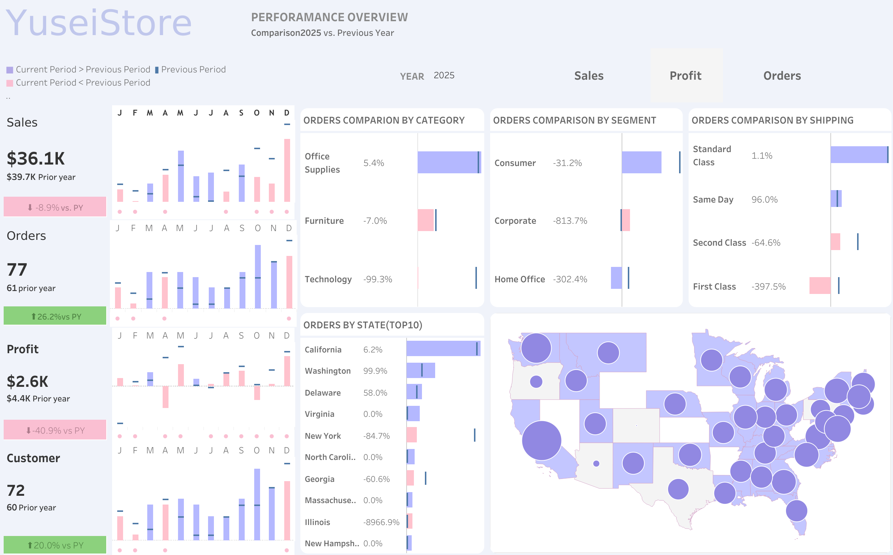

# Sales, Profit, and Orders Analysis Dashboard

## Overview

This project is an interactive Tableau dashboard built using Tableau’s sample **Superstore Sales** dataset.  
The dashboard allows users to analyze yearly performance across three key business metrics: **Sales, Profit, and Orders**.

The main purpose of this dashboard is to make year-over-year performance easy to understand at a glance. Users can switch the selected year and metric, and the entire dashboard updates dynamically.

## Dashboard Link

## 👇👇👇👇👇 CLICK THIS RIGHT NOW 👇👇👇👇👇  
## 👉👉👉 https://public.tableau.com/app/profile/yusei.hosoya/viz/Sales-Profit-OrdersbyYears/Dashboard1 👈👈👈  
## 👆👆👆👆👆 YOU'LL GET IT IN 3 SECONDS 👆👆👆👆👆

## Dataset

- Dataset: Tableau Sample Superstore Sales
- Source: Tableau built-in sample dataset
- Main fields used:
  - Order Date
  - Sales
  - Profit
  - Orders
  - Category
  - Segment
  - Region
  - State/Province
  - Customer

## Tools Used

- Tableau Public
- Calculated Fields
- Parameters
- Parameter Actions
- Year-over-Year Comparison
- Dashboard Design

## Key Features

- Dynamic year selection
- Metric switch between Sales, Profit, and Orders
- Year-over-year comparison against the previous year
- Color-coded performance:
  - Blue indicates positive growth compared to the previous year
  - Pink indicates negative growth compared to the previous year
- Previous year values are shown as reference lines
- Clean and minimal dashboard design focused on readability

## Key Analysis

### 1. Year-over-Year Performance

The dashboard compares the selected year with the previous year across Sales, Profit, and Orders.  
This makes it easy to identify whether business performance improved or declined compared to the prior year.

### 2. Monthly Trend Analysis

Each month is compared against the same period from the previous year.  
This helps reveal seasonal patterns, strong-performing months, and months where performance dropped.

### 3. Sales, Profit, and Orders Comparison

Users can switch between three main metrics:

- **Sales**: Shows revenue performance
- **Profit**: Shows profitability
- **Orders**: Shows order volume

This allows users to understand whether growth is coming from higher revenue, better profitability, or increased order activity.

### 4. Positive vs Negative Growth

The dashboard uses a simple color system to make insights faster to understand:

- Blue = increased compared to the previous year
- Pink = decreased compared to the previous year

This makes performance changes clear without needing to read every number.

### 5. Previous Year Reference Line

The line represents the previous year’s value, allowing users to directly compare current-year performance against historical performance.

## Design Approach

The dashboard was designed with a minimal and clean layout.  
I intentionally removed unnecessary visual elements to make the insights easy to understand at a glance.

Instead of adding too many charts, the dashboard focuses on a few clear visuals that answer important business questions quickly.

## Business Value

This dashboard can help business users:

- Track yearly performance
- Identify growth and decline by month
- Compare current performance against the previous year
- Understand whether Sales, Profit, or Orders are driving business changes
- Make faster decisions using simple visual signals

## What I Learned

Through this project, I practiced:

- Creating dynamic dashboards in Tableau
- Using parameters to switch between metrics
- Building year-over-year calculated fields
- Designing clean and readable business dashboards
- Using color and reference lines to communicate insights clearly

## Conclusion

This project demonstrates how Tableau can be used to create a clean and interactive business dashboard.  
By allowing users to switch between Sales, Profit, and Orders while comparing results against the previous year, the dashboard provides a simple but effective way to understand business performance.
